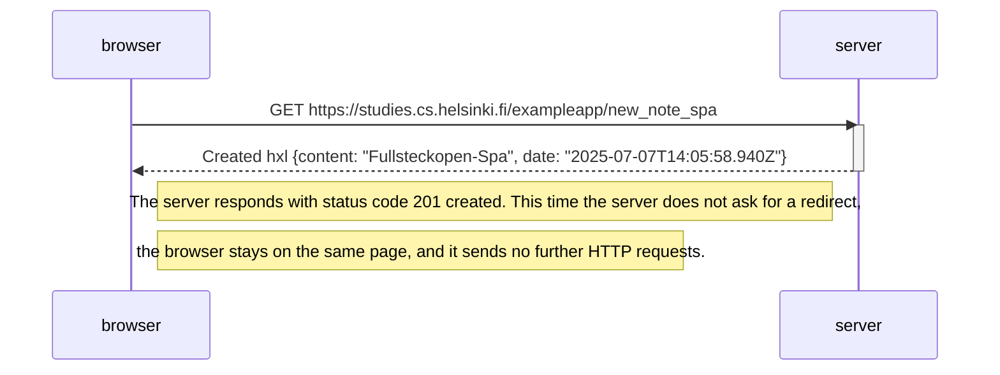

```mermaid
sequenceDiagram
    participant browser
    participant server

    browser->>server: GET https://studies.cs.helsinki.fi/exampleapp/new_note_spa
    activate server
    server-->>browser: Created hxl {content: "Fullsteckopen-Spa", date: "2025-07-07T14:05:58.940Z"}
    deactivate server

    Note right of browser: The server responds with status code 201 created. This time the server does not ask for a redirect,
    Note right of browser:  the browser stays on the same page, and it sends no further HTTP requests.
```